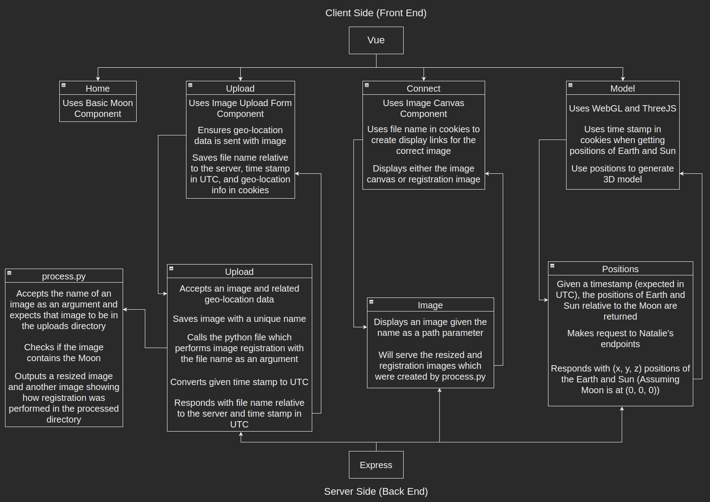

# Moon Trek
## This is an implementation of [last year's work](https://github.com/Tonize/MoonTrek-Telescope-AR) with vuejs and expressjs

## Directories:
- Client
    - public: This folder contains the base html file
    - src:
        - assets:
            - mesh: This folder contains WAC images for 3d models
            - logo.png: This icon is displayed in the browser tab
            - MoonData.json: This file contains all info for Craters, Maria, and Landing Sites which will be used on the Connect Page
        - components:
            - BasicMoon.vue: This components displays the spinning moon which is seen on home page
            - ImageCanvas.vue: This component scans through MoonData.json and displays points for the user to select. It also displays the resized image and plots the points of interest over it. Finally, it also displays information for the selected point of interest.
            - ImageUploadForm.vue: This component displays the form for the user to upload and image. It scans the selected image before uploading and checks if meta data is present. If not a form is displayed for the user to manually enter the required information (altitude, latitude, longitude, and date/time)
            - NavBar.vue: This component is used to display the navbar on every page
        - routes:
            - ConnectPage.vue: This is the route for the Connect page and displays either the image canvas data or image showing registration
            - HomePage.vue: This is the route for the Home page
            - ModelPage.vue: This is the route for the Model page and it displays the 3D model
            - Upload.vue: This is the route for the Uploading page
        - App.vue: The base vue which displays the routes. It contains the css for the animated stars background and a call to the NavBar so they show on every route
- Server
    - image-registration: This folder contains the python file which does image resizing and registration
        - globe_all: Globe images used during registration
    - images: This folder contains uploaded images in one folder and processed images (created after registration) in another folder
    - Server.js: All the code for the backend. Initializing express and all its endpoints



## Install ([video](https://www.youtube.com/watch?v=qeVeNWcuBx4)):
1. Download [NodeJs](https://nodejs.org/en/download/) and [Anaconda](https://www.anaconda.com/). Make sure to add conda to your path when installing on Windows (it will ask). If you already installed Anaconda and didn't add it to your path, follow [these instructions](https://www.youtube.com/watch?v=9ol-kyJXmnU)

2. Set up MoonTrek anaconda environment. In your terminal, run the following commands:
    ```
    conda create --name MoonTrek
    conda activate MoonTrek
    conda install python=3.7.9 django=3.1.7 numpy=1.20.1 opencv pillow=8.1.2 pytz=2021.1 sqlparse=0.4.1
    python -m pip install opencv-contrib-python==3.4.2.17
    ```

3. Clone this repository

4. Install dependencies. In a terminal, navigate to the base directory and run these commands:
    ```
    cd client
    npm install
    cd ../server
    npm install
    ```

5. Create a file called 'config.json' with the same contents of 'sample.config.json' in the server directory. Assuming you're still in the server directory from last step, run the following command:
    ```
    cp sample.config.json config.json
    ```
    Note: The IP and port are available only to developers for security purposes

6. To run, we need two terminal instances. In one cd to the client directory and run:
    ```
    npm run serve
    ```
    In the other one, cd to the server directory and run:
    ```
    npm run start
    ```
